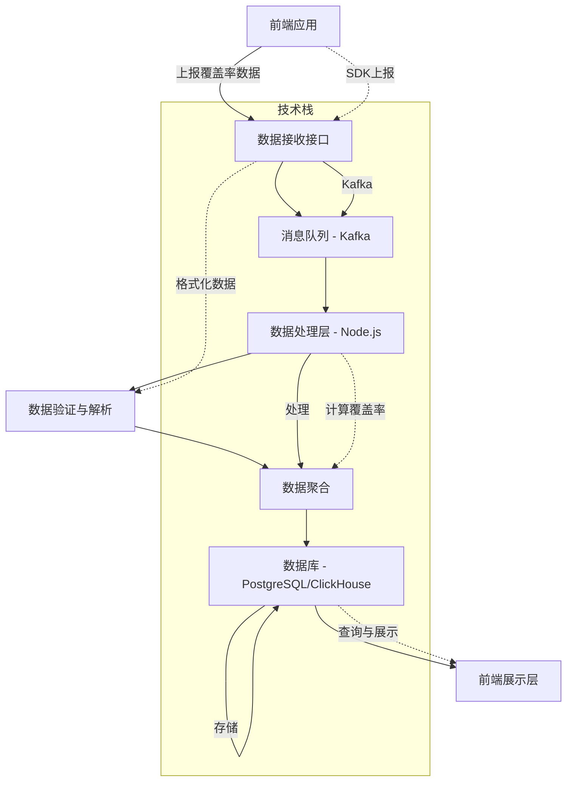

```mermaid
graph TD
A[前端应用] -->|上报覆盖率数据| B[数据接收接口]
B --> C[消息队列 - Kafka]
C --> D[数据处理层 - Node.js]
D --> E[数据验证与解析]
E --> F[数据聚合]
F --> G[数据库 - PostgreSQL/ClickHouse]
G --> H[前端展示层]

subgraph 技术栈
direction LR
B -->|Kafka| C
D -->|处理| F
G -->|存储| G
end

A -.->|SDK上报| B
B -.->|格式化数据| E
D -.->|计算覆盖率| F
G -.->|查询与展示| H

```
