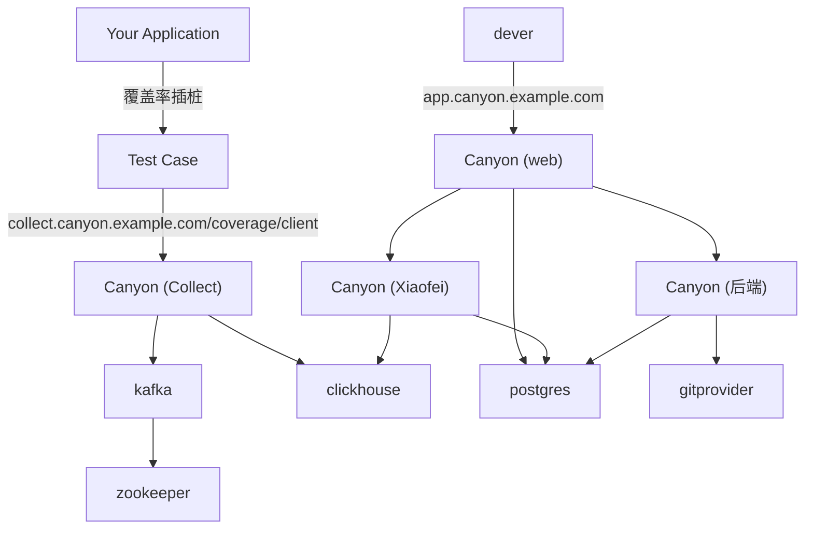

## 高可用架构

```mermaid
graph TD
  app[Your Application] --> |覆盖率插桩| lb["Test Case"]
  lb --> |"collect.canyon.example.com/coverage/client"| collect["Canyon (Collect)"]
  dever --> |"app.canyon.example.com"| sentry_web["Canyon (web)"]
  collect --> kafka
  collect --> clickhouse
  sentry_web --> snuba["Canyon (Xiaofei)"]
  sentry_web --> postgres
  snuba --> clickhouse
  snuba --> postgres
  kafka --> zookeeper
  sentry_web --> sentry_worker["Canyon (后端)"]
  sentry_worker --> gitprovider
  sentry_worker --> postgres

  click snuba "https://github.com/getsentry/snuba" "Snuba Documentation"
  click relay "https://github.com/getsentry/relay" "Relay Documentation"

```
