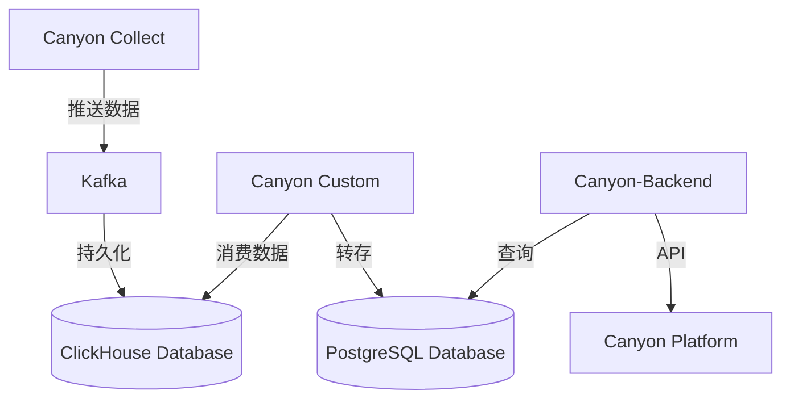

# 高可用部署方案

Canyon 支持高可用部署，采用 Kafka 和 ClickHouse 来高效处理来自 UI 自动化和大规模数据上报的高并发覆盖率数据。

### 方案架构
- **消息队列 - Kafka**：用于解耦数据的生产和消费，确保数据可靠传输，避免系统瓶颈。
- **读写分离**：通过 Kafka 实现数据的异步传输，后台服务从 PostgreSQL 读取数据进行查询，确保高效响应。并将数据写入 ClickHouse，支持 Canyon Custom 进行大数据量的消费和分析。
- **服务拆分和弹性伸缩**：通过 Kubernetes (K8s) 进行服务拆分，实现弹性伸缩，提高系统的可靠性和可用性，确保在高并发环境下仍能稳定运行。

---

这个版本对每个点进行了简化，增加了流程的连贯性，并且突出了系统高可用和高并发处理的核心要素。

## 架构图

