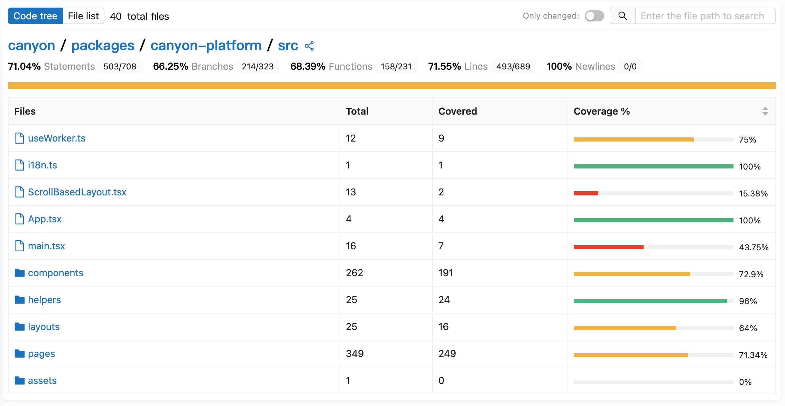

# Introduction

Canyon is a JavaScript code coverage collection platform.

Through a simple babel plugin configuration can be achieved coverage upload and real-time report generation.

import TestStep from "../../../components/TestStep";

<TestStep />
