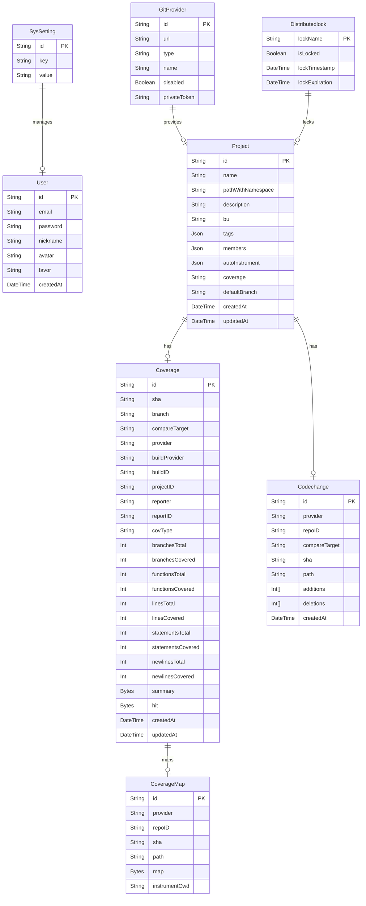

import { Callout } from "nextra/components"

# 数据库模型

Auth.js 可与任何数据库一起使用。模型会告诉您 Auth.js 期望从数据库获得什么结构。根据您使用的适配器，模型会略有不同，但一般来说，其结构与下图类似。每个模型都可以通过附加字段进行扩展。

<Callout type="info">
  Canyon的JavaScript代码中使用`驼峰命名法（camelCase）`，数据库中使用常规的`蛇形命名法（snake_case）`。
</Callout>

### User

用户模型用于存储 username 和 email 等信息。

<Callout>
  数据库中的用户创建是自动的，当用户第一次使用身份验证提供程序（OAuth）登录时发生。
</Callout>

**OAuth 登陆**

如果首次登录是通过[OAuth提供方](/getting-started/authentication/oauth)进行的，默认保存的数据为 `用户ID` `姓名` `电子邮件` 以及 `头像`。

好的，以下是为其他表添加的三级标题和说明：

---

### GitProvider

GitProvider 模型用于存储 Git 提供商的信息，例如 GitHub、GitLab 等。

<Callout>
  Git 提供商模型包含了用于认证的 `privateToken` 字段，存储与 Git 服务交互的凭证。
</Callout>

**Git 提供商配置**

GitProvider 表用于管理外部 Git 服务的配置，包括提供商 URL、类型、名称和禁用状态。用户可以通过配置不同的 Git 提供商与其项目进行集成。

---

### Coverage

Coverage 模型用于存储覆盖率数据。

<Callout>
  每个 Coverage 记录代表一次代码覆盖率的上报，它包含了多种统计信息，如行覆盖率、函数覆盖率、语句覆盖率等。
</Callout>

**覆盖率数据**

Coverage 表保存项目代码的覆盖率报告，包括覆盖率的各个维度（如函数、行、语句）和详细的统计信息。它还记录了报告的版本信息（如 SHA 值和比较目标）。

---

### CoverageMap

CoverageMap 模型用于存储代码覆盖率映射数据。

<Callout>
  通过 CoverageMap，可以将覆盖率与源代码之间建立映射关系，方便后续的调试和分析。
</Callout>

**覆盖率映射**

CoverageMap 表用于存储覆盖率映射信息，其中包括源代码路径和覆盖率信息。它能帮助开发者在查看覆盖率报告时定位具体的源代码位置。

---

### Project

Project 模型用于存储项目信息。

<Callout>
  每个项目都可以配置与之关联的覆盖率设置、成员信息和自动插桩选项。
</Callout>

**项目配置**

Project 表用于存储项目的基本信息，如项目名称、路径、描述、BU（业务单元）等。它还包含与该项目相关的自动插桩、覆盖率和团队成员等配置。

---

### Codechange

Codechange 模型用于存储代码变更记录。

<Callout>
  Codechange 表用于存储项目中每次代码变更的详细信息，包括新增和删除的行数等。
</Callout>

**代码变更记录**

Codechange 表记录了每次代码变更的详细信息，包括提交的 SHA 值、变更的路径以及新增和删除的行数。这些信息可以帮助开发者了解代码库的演变过程。

---

### Distributedlock

Distributedlock 模型用于存储分布式锁信息。

<Callout>
  分布式锁是为了确保在分布式环境下只有一个进程可以访问某些资源，防止多个进程发生冲突。
</Callout>

**分布式锁管理**

Distributedlock 表用于存储关于锁的信息，包括锁名称、锁状态、锁的时间戳和过期时间。它能够确保在多个实例之间执行某些操作时的互斥性。
